# Git Branching Tutorial

## Intro
Branching allows you to take a copy of a repo, work on the copy without affecting the repo itself, then merge the copy's changes back to the repo. This prevents buggy or experimental codes or changes from affecting the repo, as well as minimizes commit conflits if multiple people are working on the repo at the same time.

Abstract: A repo has a **main** branch, where all changes goes to and where the final product will be compiled from. When branching, you are creating a copy of the **main** branch (You can name the new branch whatever you want), you can then make any changes to the new branch. Once you are happy with your changes, you can then create a "pull request" (request to merge the new branch alongside your changes back to the **main** branch). The "pull request" is then reviewed by all contributors of the repo, if everyone agrees, the new branch is then merged with the **main** branch. 

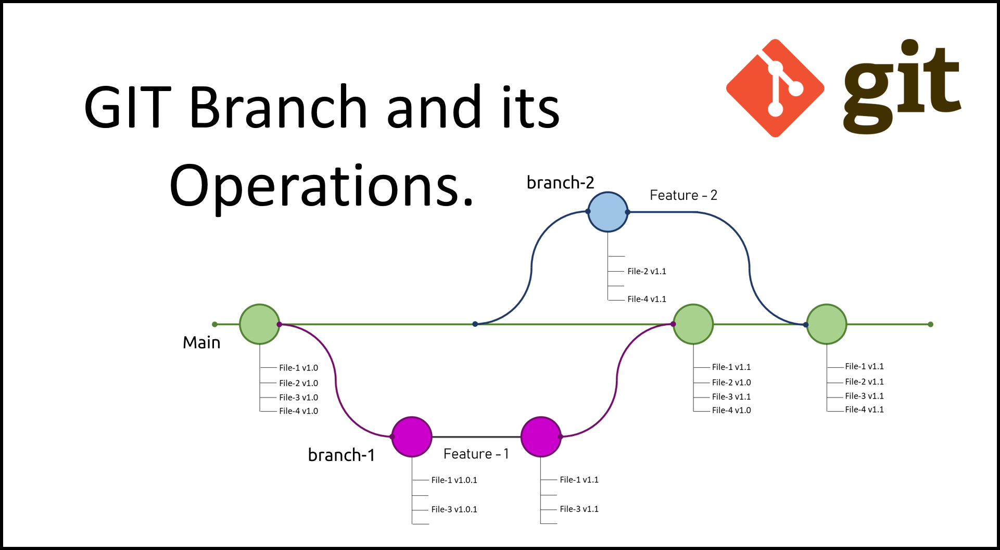

## Steps
### • Step 1: Clone your repo
\* Skip this step if you already had your repo ready on your local PC.

https://docs.github.com/en/repositories/creating-and-managing-repositories/cloning-a-repository

### • Step 2: Create a branch on GitHub

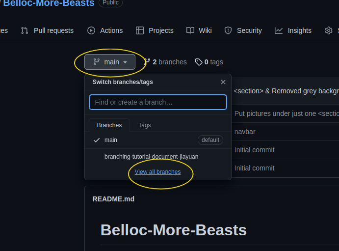
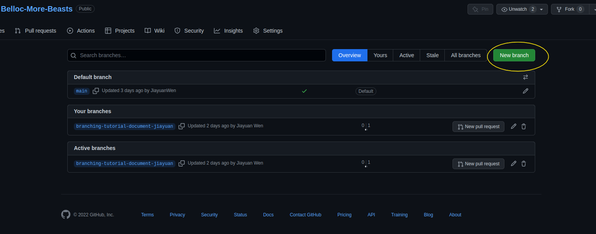
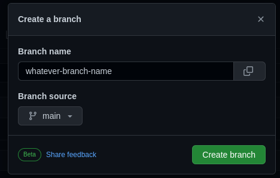 \
\* Note: You can name your branch whatever you want, do remember this name as you will be using it in future steps. \
\* Tip: "Branch source" is the branch you want to copy from. You can also branch out from other people's branch by changing this, but things can get messy this way.

### • Step 3: On your local repo folder, git pull, then "checkout" the new branch you created
\* I'm using Linux Terminal with git built-in in my screenshot, the commands should be the same for your Git Bash.
 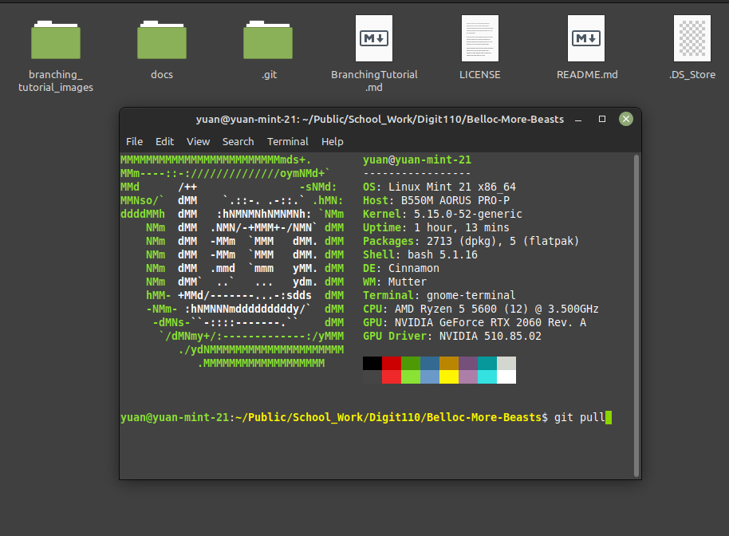
  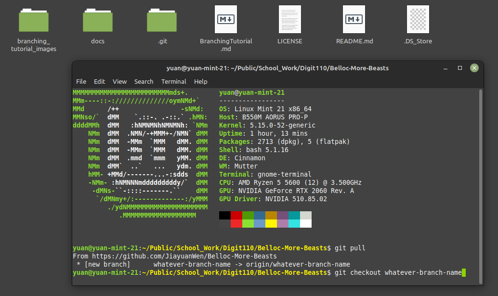

### • Step 4: Now make your changes. Add, commit, push as normal.

### • Step 5: When done with your changes, git checkout main to go back to main branch in your local repo, then git pull again.
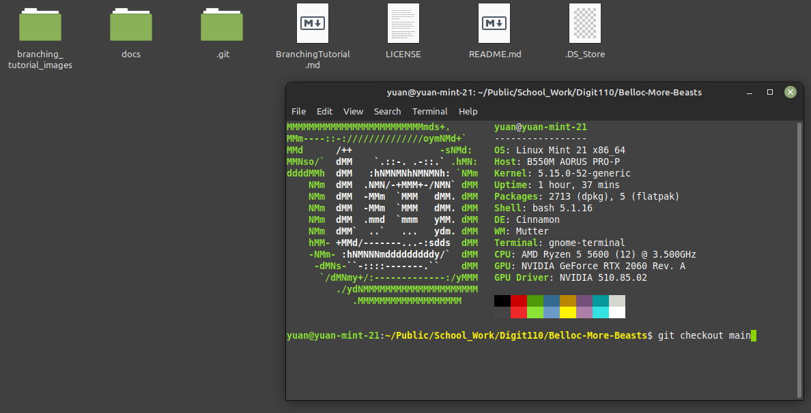
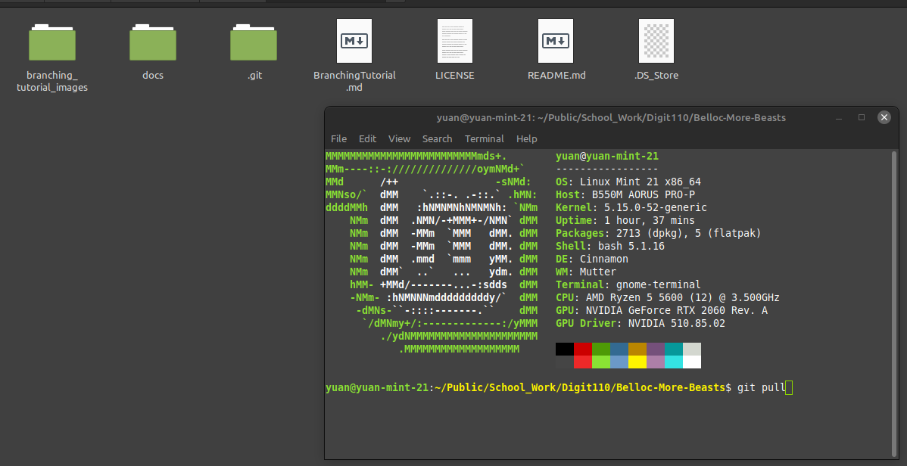

### • Step 6: Go back to GitHub, and start a pull request.
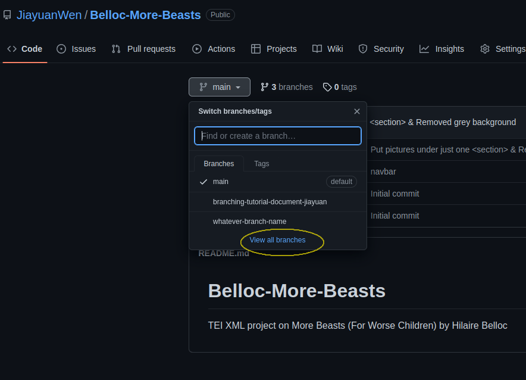
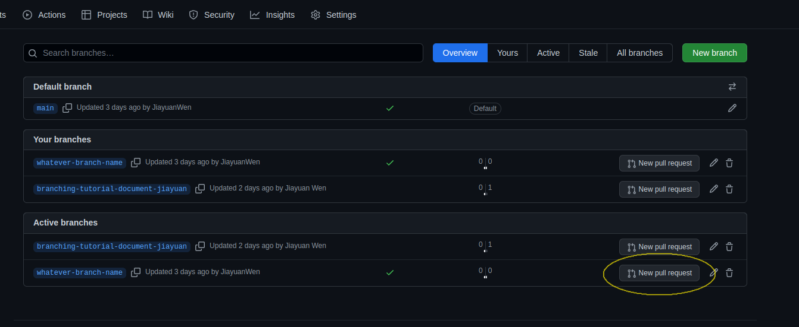
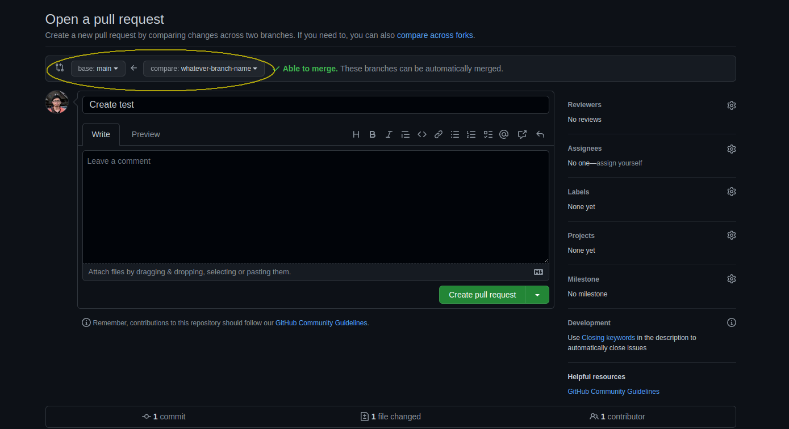 \
\* The arrow at the top is the branch your branch and changes will merge into. Make sure it is pointed to **main**. If you branched out from another person's branch during Step 2, make sure to change that accordingly. 

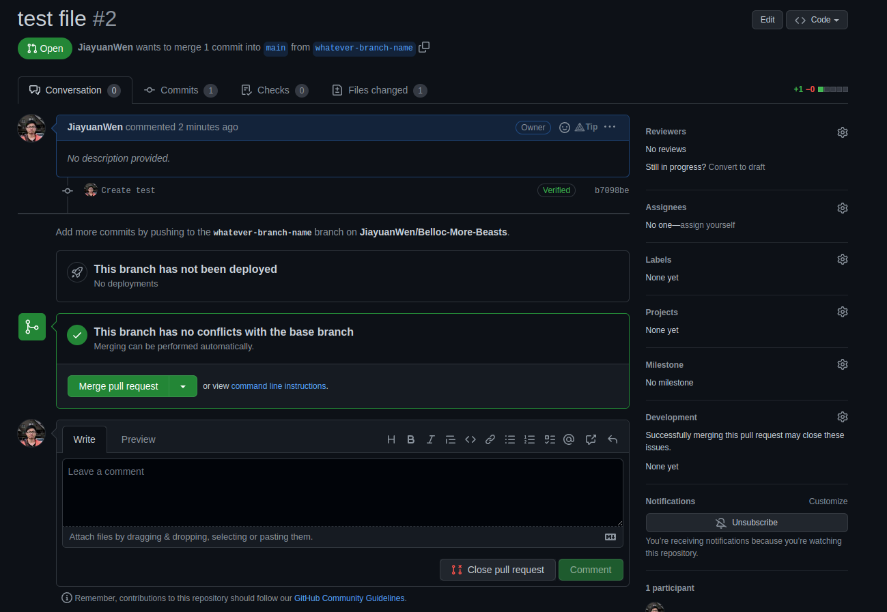

Once you clicked on "Create pull request", the pull request becomes a discussion forum. You can either discuss with collaborators on the changes, or merge the pull request right away (former is recommended). If pull request is problematic, you can close the pull request. You can also assign reviewers, create labels to this pull request forum, and many more on the right. 

### • Step 7: Delete the branch.
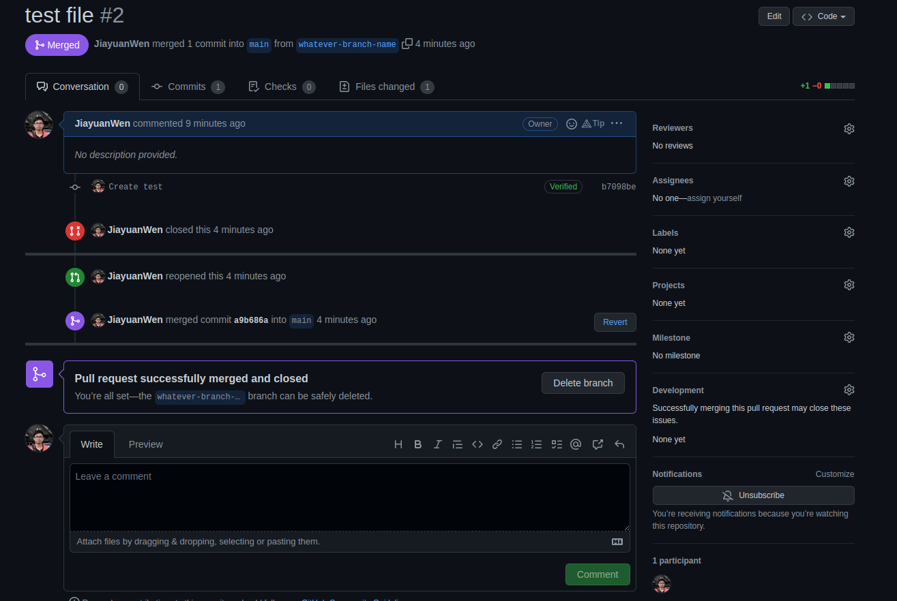
* Now you have the option to delete the branch. Recommend do so unless you want to make further changes and plan to start new pull requests later. 

